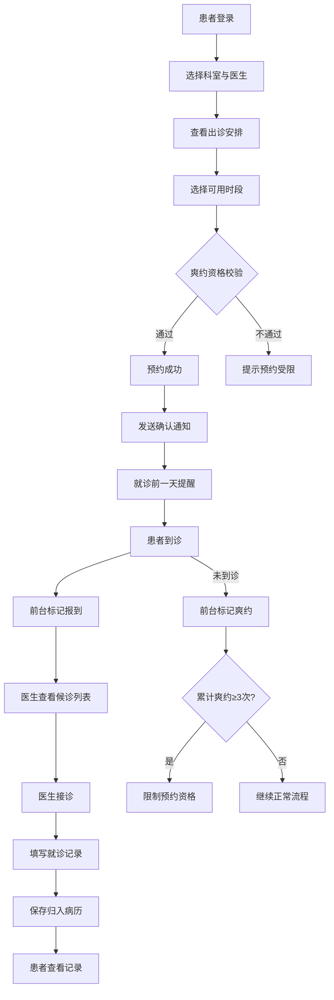

## 1. 产品概述

诊所预约与就诊管理系统，为诊所提供从预约挂号到就诊记录全流程数字化管理。解决传统诊所预约混乱、候诊无序、病历分散的问题，面向患者、医生、前台三类角色，实现出诊排班智能生成、在线预约、就诊记录归档、爽约管控等核心能力。

## 2. 核心功能

### 2.1 用户角色

| 角色 | 注册方式 | 核心权限 |
|------|----------|----------|
| 患者 | 手机号注册 | 浏览出诊安排、在线预约、查看病历、管理健康档案 |
| 医生 | 管理员分配账号 | 配置出诊时间表、查看候诊列表、填写就诊记录与处方 |
| 前台 | 管理员分配账号 | 查看当日预约队列、标记患者报到、爽约管理 |
| 管理员 | 系统内置 | 科室管理、医生账号管理、系统配置 |

### 2.2 功能模块

1. **登录/注册页**：角色选择、手机号注册登录、健康档案首次填写
2. **患者工作台**：科室浏览、医生出诊查询、在线预约、我的预约、个人中心（健康档案、就诊记录、处方查看）
3. **医生工作台**：出诊排班配置、候诊列表、接诊与就诊记录填写（主诉、诊断、处方）
4. **前台工作台**：当日预约队列、报到签到、爽约标记、预约检索
5. **通知中心**：预约确认通知、就诊前提醒

### 2.3 页面详情

| 页面名称 | 模块名称 | 功能描述 |
|----------|----------|----------|
| 登录/注册页 | 角色选择 | 患者注册/登录，医生/前台账号登录 |
| 登录/注册页 | 健康档案填写 | 首次注册患者填写基本信息、过敏史、慢性病 |
| 患者工作台 | 科室与医生浏览 | 按科室筛选医生，查看医生简介与出诊安排 |
| 患者工作台 | 在线预约 | 选择日期与时段提交预约，显示可约/已满状态 |
| 患者工作台 | 我的预约 | 查看预约列表、取消预约、查看预约状态 |
| 患者工作台 | 个人中心-健康档案 | 查看/编辑基本信息、过敏史、慢性病 |
| 患者工作台 | 个人中心-就诊记录 | 查看历次就诊记录详情（主诉、诊断、处方） |
| 医生工作台 | 出诊排班 | 按周配置出诊时段，系统自动生成可预约时间格 |
| 医生工作台 | 候诊列表 | 查看当日已报到患者队列，按预约顺序排列 |
| 医生工作台 | 就诊记录 | 填写主诉、诊断、处方，保存归入患者病历 |
| 前台工作台 | 当日预约队列 | 按时段展示当日全部预约，显示报到/未报到/爽约状态 |
| 前台工作台 | 报到签到 | 标记患者已到诊，通知医生诊室 |
| 前台工作台 | 爽约标记 | 标记未报到患者为爽约，系统自动累计爽约次数 |
| 通知中心 | 预约确认 | 预约成功后发送确认通知 |
| 通知中心 | 就诊提醒 | 就诊前一天自动发送提醒通知 |

## 3. 核心流程

### 预约流程
患者登录 → 选择科室 → 选择医生 → 查看出诊安排 → 选择可用时段 → 提交预约 → 系统校验爽约资格 → 预约成功 → 发送确认通知 → 就诊前一天发送提醒

### 就诊流程
患者到诊 → 前台标记报到 → 医生诊室显示候诊 → 医生接诊 → 填写就诊记录（主诉、诊断、处方）→ 保存归档 → 患者可查看

### 爽约管理流程
前台标记爽约 → 系统累计爽约次数 → 连续3次爽约 → 自动限制预约资格 → 管理员可手动解除

## 4. 用户界面设计

### 4.1 设计风格

- **主题风格**：治愈系自然风，清新专业，传达医疗信赖感
- **主色调**：翡翠绿 (#0D9373) 搭配暖白底 (#FAFBF9)，强调色琥珀橙 (#E8913A)
- **辅助色**：浅薄荷绿 (#E8F5F0) 用于卡片背景，柔灰 (#6B7280) 用于次级文字
- **按钮风格**：圆角 8px，主按钮翡翠绿实色，次按钮描边，危险操作琥珀橙
- **字体**：标题使用 Noto Serif SC 衬线体传递专业感，正文使用 DM Sans 保持可读性
- **布局风格**：侧边导航 + 内容区，卡片式信息展示，左侧固定导航栏
- **图标风格**：线性图标（Phosphor Icons），2px 描边，柔和圆润
- **动效**：页面切换淡入，列表交错入场，状态变更微弹动，通知滑入

### 4.2 页面设计概览

| 页面名称 | 模块名称 | UI 元素 |
|----------|----------|----------|
| 登录/注册页 | 登录表单 | 居中卡片式表单，左侧装饰插画区，角色标签页切换，输入框带图标 |
| 患者工作台 | 科室浏览 | 顶部搜索栏，科室卡片网格（图标+名称），点击进入医生列表 |
| 患者工作台 | 医生出诊安排 | 医生信息卡，周历视图展示出诊时段，可用时段绿色/已满灰色 |
| 患者工作台 | 在线预约 | 日期选择器，时段列表，预约确认弹窗，预约状态标签 |
| 患者工作台 | 我的预约 | 时间线式预约列表，状态徽章（待就诊/已就诊/已取消/爽约），取消按钮 |
| 患者工作台 | 健康档案 | 表单分组卡片（基本信息/过敏史/慢性病），编辑模式切换 |
| 患者工作台 | 就诊记录 | 时间线式记录列表，展开查看详情（诊断/处方），处方药品列表 |
| 医生工作台 | 出诊排班 | 周视图表格，时段格子可点击切换出诊/休息，批量操作工具栏 |
| 医生工作台 | 候诊列表 | 左侧患者列表（序号+姓名+时段），右侧就诊记录表单，状态标签 |
| 医生工作台 | 就诊记录 | 分步表单（主诉→诊断→处方），处方药品可添加多行，保存按钮 |
| 前台工作台 | 当日预约队列 | 时段分组表格，状态列带颜色标签，报到/爽约操作按钮，统计卡片 |
| 前台工作台 | 爽约管理 | 爽约患者列表，累计次数标记，限制状态开关，解除限制按钮 |
| 通知中心 | 通知列表 | 右侧滑出面板，未读标记，通知类型图标，时间戳 |

### 4.3 响应式设计

- 桌面优先设计，主要适配 1280px+ 宽度
- 平板端侧边导航折叠为汉堡菜单，卡片网格自适应列数
- 移动端隐藏侧边导航，内容区全宽，表格转为卡片列表

### 4.4 3D 场景

不适用
