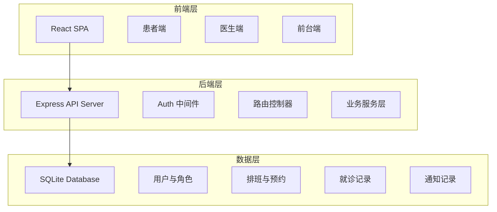
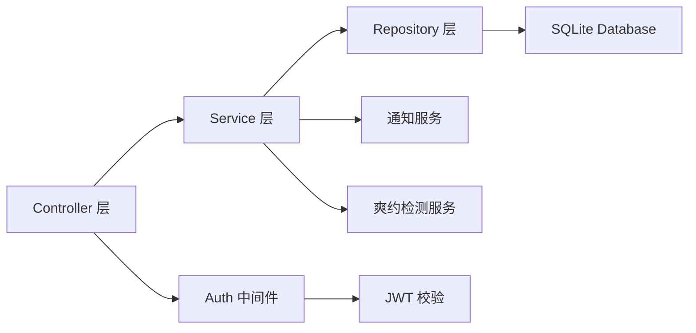
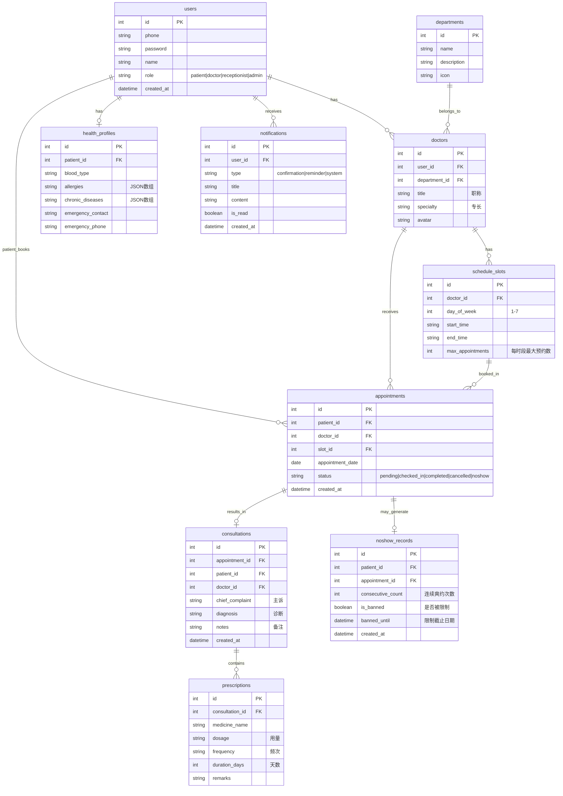

## 1. 架构设计



## 2. 技术说明

- **前端**：React@18 + TypeScript + TailwindCSS@3 + Vite
- **初始化工具**：Vite (react-ts template)
- **后端**：Express@4 + better-sqlite3
- **数据库**：SQLite（文件数据库，无需额外安装）
- **状态管理**：React Context + useReducer
- **路由**：React Router v6
- **UI 组件库**：Headless UI + TailwindCSS 自定义组件
- **图标**：Phosphor React
- **日期处理**：date-fns
- **通知机制**：前端 Toast + 定时轮询提醒

## 3. 路由定义

| 路由 | 用途 |
|------|------|
| `/login` | 登录/注册页面 |
| `/register` | 患者注册与健康档案填写 |
| `/patient` | 患者工作台首页（科室浏览） |
| `/patient/doctors/:deptId` | 科室下医生列表 |
| `/patient/schedule/:doctorId` | 医生出诊安排与预约 |
| `/patient/appointments` | 我的预约 |
| `/patient/records` | 就诊记录列表 |
| `/patient/records/:id` | 就诊记录详情 |
| `/patient/profile` | 健康档案管理 |
| `/doctor` | 医生工作台（候诊列表） |
| `/doctor/schedule` | 出诊排班配置 |
| `/doctor/consultation/:id` | 接诊记录填写 |
| `/doctor/records` | 历史就诊记录 |
| `/reception` | 前台工作台（当日预约队列） |
| `/reception/noshow` | 爽约管理 |
| `/admin` | 管理后台（科室/账号管理） |

## 4. API 定义

### 认证相关

```typescript
POST /api/auth/register
  body: { phone: string; password: string; name: string }
  response: { token: string; user: User }

POST /api/auth/login
  body: { phone: string; password: string; role: string }
  response: { token: string; user: User }
```

### 科室与医生

```typescript
GET /api/departments
  response: Department[]

GET /api/departments/:id/doctors
  response: Doctor[]

GET /api/doctors/:id/schedule?weekStart=YYYY-MM-DD
  response: ScheduleSlot[]

GET /api/doctors/:id/appointments?date=YYYY-MM-DD
  response: Appointment[]
```

### 预约管理

```typescript
POST /api/appointments
  body: { doctorId: number; slotId: number; date: string }
  response: Appointment

GET /api/appointments/mine
  response: Appointment[]

DELETE /api/appointments/:id
  response: { success: boolean }

PATCH /api/appointments/:id/checkin
  response: Appointment

PATCH /api/appointments/:id/noshow
  response: Appointment
```

### 排班管理

```typescript
GET /api/schedules?doctorId=number
  response: ScheduleSlot[]

POST /api/schedules/batch
  body: { doctorId: number; slots: { dayOfWeek: number; startTime: string; endTime: string }[] }
  response: ScheduleSlot[]

DELETE /api/schedules/:id
  response: { success: boolean }
```

### 就诊记录

```typescript
POST /api/consultations
  body: { appointmentId: number; chiefComplaint: string; diagnosis: string; prescriptions: Prescription[] }
  response: Consultation

GET /api/consultations/patient/:patientId
  response: Consultation[]

GET /api/consultations/:id
  response: Consultation
```

### 健康档案

```typescript
GET /api/health-profiles/mine
  response: HealthProfile

PUT /api/health-profiles/mine
  body: { allergies: string[]; chronicDiseases: string[]; bloodType: string; emergencyContact: string }
  response: HealthProfile
```

### 通知

```typescript
GET /api/notifications/mine
  response: Notification[]

PATCH /api/notifications/:id/read
  response: Notification
```

### 爽约管理

```typescript
GET /api/noshow-records?patientId=number
  response: NoShowRecord[]

PATCH /api/noshow-records/:id/lift-ban
  response: NoShowRecord

GET /api/patients/banned
  response: Patient[]
```

### 前台

```typescript
GET /api/reception/today-queue
  response: Appointment[]

GET /api/reception/appointments?date=YYYY-MM-DD
  response: Appointment[]
```

## 5. 服务端架构图



## 6. 数据模型

### 6.1 数据模型定义



### 6.2 数据定义语言

```sql
CREATE TABLE users (
  id INTEGER PRIMARY KEY AUTOINCREMENT,
  phone TEXT NOT NULL UNIQUE,
  password TEXT NOT NULL,
  name TEXT NOT NULL,
  role TEXT NOT NULL CHECK(role IN ('patient','doctor','receptionist','admin')),
  created_at TEXT DEFAULT (datetime('now'))
);

CREATE TABLE departments (
  id INTEGER PRIMARY KEY AUTOINCREMENT,
  name TEXT NOT NULL,
  description TEXT,
  icon TEXT
);

CREATE TABLE doctors (
  id INTEGER PRIMARY KEY AUTOINCREMENT,
  user_id INTEGER NOT NULL REFERENCES users(id),
  department_id INTEGER NOT NULL REFERENCES departments(id),
  title TEXT,
  specialty TEXT,
  avatar TEXT
);

CREATE TABLE schedule_slots (
  id INTEGER PRIMARY KEY AUTOINCREMENT,
  doctor_id INTEGER NOT NULL REFERENCES doctors(id),
  day_of_week INTEGER NOT NULL CHECK(day_of_week BETWEEN 1 AND 7),
  start_time TEXT NOT NULL,
  end_time TEXT NOT NULL,
  max_appointments INTEGER DEFAULT 1
);

CREATE TABLE appointments (
  id INTEGER PRIMARY KEY AUTOINCREMENT,
  patient_id INTEGER NOT NULL REFERENCES users(id),
  doctor_id INTEGER NOT NULL REFERENCES doctors(id),
  slot_id INTEGER NOT NULL REFERENCES schedule_slots(id),
  appointment_date TEXT NOT NULL,
  status TEXT DEFAULT 'pending' CHECK(status IN ('pending','checked_in','completed','cancelled','noshow')),
  created_at TEXT DEFAULT (datetime('now'))
);

CREATE TABLE health_profiles (
  id INTEGER PRIMARY KEY AUTOINCREMENT,
  patient_id INTEGER NOT NULL UNIQUE REFERENCES users(id),
  blood_type TEXT,
  allergies TEXT DEFAULT '[]',
  chronic_diseases TEXT DEFAULT '[]',
  emergency_contact TEXT,
  emergency_phone TEXT
);

CREATE TABLE consultations (
  id INTEGER PRIMARY KEY AUTOINCREMENT,
  appointment_id INTEGER NOT NULL UNIQUE REFERENCES appointments(id),
  patient_id INTEGER NOT NULL REFERENCES users(id),
  doctor_id INTEGER NOT NULL REFERENCES doctors(id),
  chief_complaint TEXT,
  diagnosis TEXT,
  notes TEXT,
  created_at TEXT DEFAULT (datetime('now'))
);

CREATE TABLE prescriptions (
  id INTEGER PRIMARY KEY AUTOINCREMENT,
  consultation_id INTEGER NOT NULL REFERENCES consultations(id),
  medicine_name TEXT NOT NULL,
  dosage TEXT,
  frequency TEXT,
  duration_days INTEGER,
  remarks TEXT
);

CREATE TABLE notifications (
  id INTEGER PRIMARY KEY AUTOINCREMENT,
  user_id INTEGER NOT NULL REFERENCES users(id),
  type TEXT NOT NULL CHECK(type IN ('confirmation','reminder','system')),
  title TEXT NOT NULL,
  content TEXT NOT NULL,
  is_read INTEGER DEFAULT 0,
  created_at TEXT DEFAULT (datetime('now'))
);

CREATE TABLE noshow_records (
  id INTEGER PRIMARY KEY AUTOINCREMENT,
  patient_id INTEGER NOT NULL REFERENCES users(id),
  appointment_id INTEGER NOT NULL REFERENCES appointments(id),
  consecutive_count INTEGER DEFAULT 1,
  is_banned INTEGER DEFAULT 0,
  banned_until TEXT,
  created_at TEXT DEFAULT (datetime('now'))
);

CREATE INDEX idx_appointments_patient ON appointments(patient_id);
CREATE INDEX idx_appointments_doctor ON appointments(doctor_id);
CREATE INDEX idx_appointments_date ON appointments(appointment_date);
CREATE INDEX idx_schedule_slots_doctor ON schedule_slots(doctor_id);
CREATE INDEX idx_notifications_user ON notifications(user_id);
CREATE INDEX idx_noshow_patient ON noshow_records(patient_id);

INSERT INTO departments (name, description, icon) VALUES
('内科', '常见内科疾病诊疗', 'heart'),
('外科', '外科疾病诊疗与手术', 'bone'),
('儿科', '儿童疾病诊疗', 'baby'),
('妇科', '妇女健康诊疗', 'flower'),
('皮肤科', '皮肤疾病诊疗', 'drop'),
('中医科', '中医诊疗与调理', 'leaf'),
('口腔科', '口腔疾病诊疗', 'tooth'),
('眼科', '眼科疾病诊疗', 'eye');

INSERT INTO users (phone, password, name, role) VALUES
('13800000001', '$2a$10$dummyhash1', '张医生', 'doctor'),
('13800000002', '$2a$10$dummyhash2', '李医生', 'doctor'),
('13800000003', '$2a$10$dummyhash3', '王前台', 'receptionist'),
('13800000004', '$2a$10$dummyhash4', '管理员', 'admin');

INSERT INTO doctors (user_id, department_id, title, specialty) VALUES
(1, 1, '主任医师', '心血管疾病、呼吸系统疾病'),
(2, 6, '副主任医师', '中医调理、针灸推拿');
```
